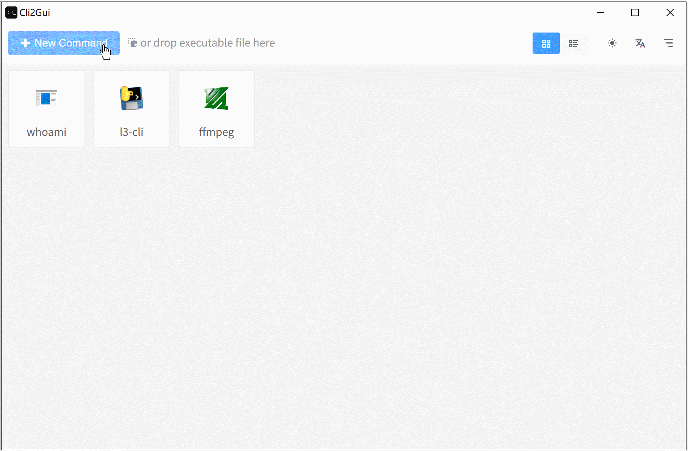
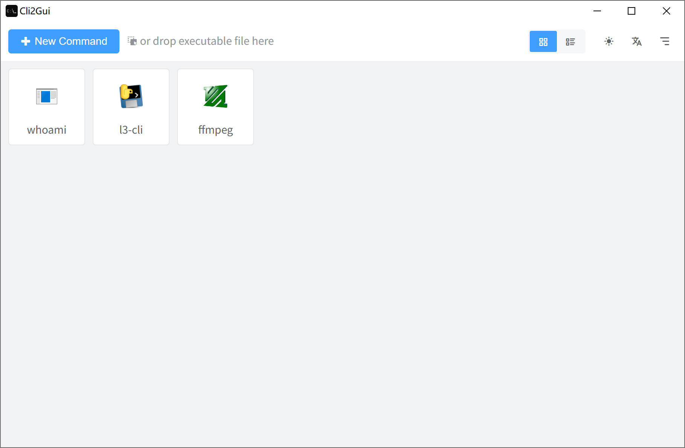
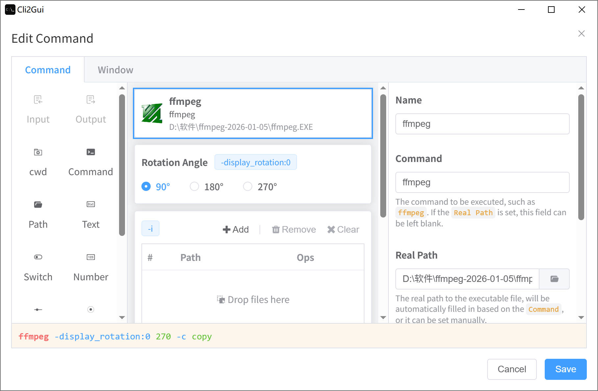
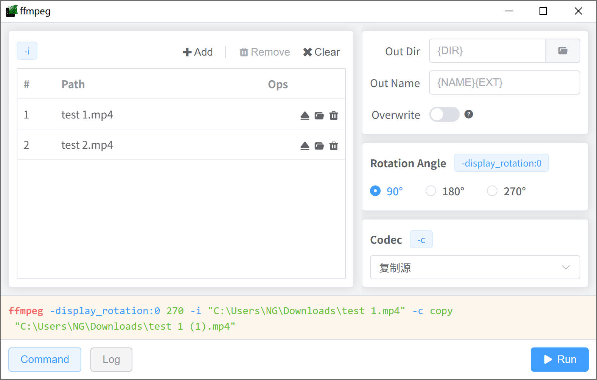

# Cli2Gui

A tool to convert command-line tools into GUI applications, built with Electron, Vue and TypeScript.

一个将命令行工具转换为图形界面应用的工具，使用 Electron、Vue 和 TypeScript 构建。

## Features

- 🚫 Zero-code, visual form manipulation
- ⚡ Batch processing
- 💻 Support for Windows, ~~macOS and Linux (Under development)~~
- 🌐 Support for multiple languages (English, 中文)
- ⤴️ Supports creating a separate desktop shortcut for each command (Windows only)
- 🌙 Supports dark mode

### Screenshots



Commands View:<br>


Edit View:<br>


Run View:<br>


## Project Setup

### Install

```bash
$ pnpm install
```

### Development

```bash
$ pnpm dev
```

### Build

```bash
# For windows
$ pnpm build:win

# For macOS
$ pnpm build:mac

# For Linux
$ pnpm build:linux
```
